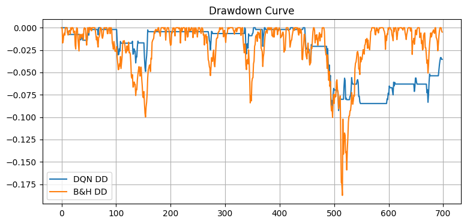

# Model Improvement Journey

## Summary
The RL model improved from **negative returns** to **positive returns** after changing the action space, adding realistic trading constraints, and tuning hyperparameters on validation Sharpe.

Key improvement: the tuned model achieved **+12.7% Total Return** on the test set, compared with earlier runs that produced large negative returns.

## Baseline (Earlier DQN)
**Outcome:** negative returns, negative Sharpe, deep drawdowns.

Example test results (earlier run):
- Total Return: **-0.3269**
- Annual Return: **-0.1330**
- Annual Vol: **0.1210**
- Sharpe: **-1.0988**
- Max Drawdown: **-0.3932**
- Win Rate: **0.3619**

## Tuned DQN (Best Validation Sharpe)
**Outcome:** positive returns, positive Sharpe, lower drawdown.

Best config (selected on validation Sharpe):
- lr: **0.0003**
- gamma: **0.99**
- hidden: **64**
- episodes: **15**
- batch_size: **64**
- min_hold: **5**
- trade_penalty: **0.0002**
- drawdown_lambda: **0.02**
- long_only: **True**

Test results for tuned model:
- Total Return: **+0.1270**
- Annual Return: **+0.0440**
- Annual Vol: **0.0710**
- Sharpe: **0.6203**
- Max Drawdown: **-0.0937**
- Win Rate: **0.1259**

## Improvement Snapshot
- **Total Return:** from **-32.7%** to **+12.7%** (approx **+45.4 percentage points** improvement)
- **Sharpe:** from **-1.10** to **+0.62** (clear shift to positive risk-adjusted performance)
- **Max Drawdown:** from **-0.39** to **-0.094** (lower downside risk)

## Parameters and Their Effects
| Parameter | Change | Effect Observed |
|---|---|---|
| `long_only` | `False` -> `True` | Reduced harmful shorts in a long-biased market, improving stability. |
| `min_hold` | `3` -> `5` | Reduced overtrading, improved drawdown. |
| `trade_penalty` | `0.0005` -> `0.0002` | Less friction per trade, better net returns. |
| `drawdown_lambda` | `0.05` -> `0.02` | Less aggressive penalty, improved upside without huge risk. |
| `lr` | `5e-4` -> `3e-4` | More stable learning, less noisy training. |
| `episodes` | `40` -> `15` | Faster tuning; final model still improved due to better constraints. |
| `hidden` | `128` -> `64` | Simpler model, less overfitting. |

## Final Note
Even after improvement, Buy & Hold still outperformed on this dataset. The tuning shows that RL can be improved substantially, but **baseline strategies remain very strong** in trending markets like SPY and AAPL.

## Charts

